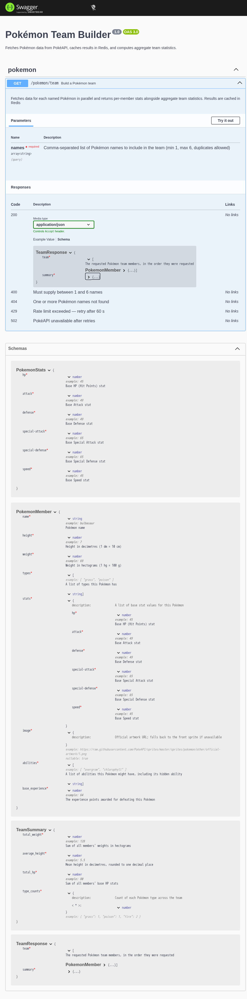
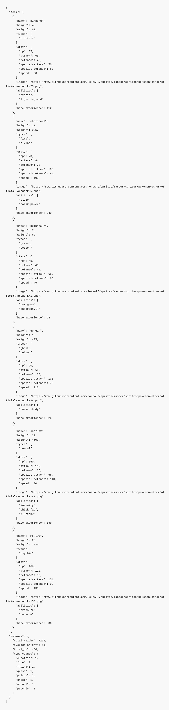

# Pokémon Team Builder

NestJS service that builds a Pokémon team from [PokéAPI](https://pokeapi.co/docs/v2) data, caches results in Redis, and computes aggregate team statistics.

---

## Live demo

Deployed on Render — no setup required:

| URL                                                                                                      | Description            |
| -------------------------------------------------------------------------------------------------------- | ---------------------- |
| `https://pokemon-c5i3.onrender.com/pokemon/team?names=pikachu,charizard,bulbasaur,gengar,snorlax,mewtwo` | Example request        |
| `https://pokemon-c5i3.onrender.com/api`                                                                  | Interactive Swagger UI |

> **Note:** the free Render instance spins down after inactivity — the first request may take ~30 s to cold-start.

---

## Quick start

**Docker (recommended — includes Redis):**

```bash
docker compose up --build
```

**Local dev (requires Redis on `localhost:6379`):**

```bash
npm install
npm run start:dev
```

| URL                                                                    | Description            |
| ---------------------------------------------------------------------- | ---------------------- |
| `http://localhost:3000/pokemon/team?names=pikachu,charizard,bulbasaur` | Example request        |
| `http://localhost:3000/api`                                            | Interactive Swagger UI |

---

## API

### `GET /pokemon/team`

| Parameter | Type     | Constraints                                                        |
| --------- | -------- | ------------------------------------------------------------------ |
| `names`   | `string` | Comma-separated; 1–6 entries; duplicates allowed; case-insensitive |

**Example response** (abbreviated):

```json
{
  "team": [
    {
      "name": "bulbasaur",
      "height": 7,
      "weight": 69,
      "types": ["grass", "poison"],
      "stats": {
        "hp": 45,
        "attack": 49,
        "defense": 49,
        "special-attack": 65,
        "special-defense": 65,
        "speed": 45
      },
      "image": "https://raw.githubusercontent.com/PokeAPI/sprites/master/sprites/pokemon/other/official-artwork/1.png",
      "abilities": ["overgrow", "chlorophyll"],
      "base_experience": 64
    }
  ],
  "summary": {
    "total_weight": 69,
    "average_height": 7.0,
    "total_hp": 45,
    "type_counts": { "grass": 1, "poison": 1 }
  }
}
```

Height is in decimetres, weight in hectograms — PokéAPI conventions. Full schema is available in the Swagger UI at `/api`.

**Error responses:**

| Status | Condition                                                    |
| ------ | ------------------------------------------------------------ |
| `400`  | Missing `names`, empty after parsing, or more than 6 entries |
| `404`  | One or more names not found in PokéAPI                       |
| `429`  | Rate limit exceeded (60 requests per minute per IP)          |
| `502`  | PokéAPI unavailable after retries                            |

---

## Architecture

```
GET /pokemon/team?names=pikachu,charizard
         │
  PokemonController    validates & transforms query params (TeamQueryDto)
         │
  PokemonService
         └── buildTeam()    deduplicates names → fans out fetchPokemon() via Promise.all. Latency bounded by the slowest single fetch, not the sum
                ├── fetchPokemon()    cache-aside per unique name
                │     ├── Redis hit ──→ return cached PokemonMember directly
                │     └── Redis miss:
                │             └── fetchFromPokeApi()    HTTP GET + linear-backoff retry on 5xx/network
                │                     └── mapPokemon() / mapPokemonStats()  raw → PokemonMember
                │             └── Redis.set()    write-through; write failures propagate unmasked
                └── computeTeamSummary()    single O(n) pass over assembled team → TeamSummary
```

---

## Design highlights

**Parallel fetching with deduplication**
`buildTeam` deduplicates the name list with `new Set` before fanning out, so a Pokémon repeated in a team (allowed by the spec) incurs only one cache lookup and at most one PokéAPI call. `Promise.all` runs the unique fetches concurrently — latency is bounded by the slowest individual request, not the sum of all of them. The full team, including duplicates, is reassembled from an in-memory `Map` once all promises resolve.

**Cache-aside with Redis**
Each Pokémon is cached under a `pokemon:<name>` key. The cache stores the already-mapped `PokemonMember` shape, not the raw API response, so cache hits require no reprocessing. TTL is configurable via `CACHE_TTL_MS`. The `pokemon:` namespace isolates keys if the Redis instance is shared. Cache write failures are intentionally not caught in `fetchPokemon` — they propagate loudly rather than being silently swallowed or misreported as a PokéAPI error.

**Retry with linear backoff**
`fetchFromPokeApi` retries 5xx responses and network errors up to three times, with a delay of 500 ms × attempt number (500 ms, 1 s, 1.5 s). 4xx responses are never retried: a 404 is a deterministic client error mapped to `NotFoundException`; any other 4xx maps immediately to `BadGatewayException`. Retrying a 404 is semantically wrong; retrying a 400 is wasteful and would only mask a client bug.

**Layered error semantics**
PokéAPI errors are translated to correct HTTP responses at the service boundary. The client always gets a meaningful status code — 404 when a Pokémon doesn't exist, 502 when the upstream is at fault — rather than a generic 500.

**Input validation and transformation pipeline**
`TeamQueryDto` uses `class-transformer` to split on commas, trim whitespace, lowercase, and filter empty strings before any validation runs. `class-validator` then enforces `@ArrayMinSize(1)` and `@ArrayMaxSize(6)`. Global `ValidationPipe({ whitelist: true, transform: true })` strips any undeclared properties. Lowercasing at parse time means `Pikachu`, `PIKACHU`, and `pikachu` all resolve the same cache key.

**Swagger**
All DTOs are annotated with `@ApiProperty` (descriptions, examples, nullable flags, array types). The controller uses `@ApiOperation` and `@ApiXxxResponse` for each outcome. The Swagger UI at `/api` is fully generated from these decorators — there is no separate spec file to maintain or drift out of sync.

**Helmet**
`helmet()` is applied globally in `main.ts`, setting security-relevant HTTP headers (`X-Content-Type-Options`, `X-Frame-Options`, `Strict-Transport-Security`, Content Security Policy, and others) on every response. A zero-effort security baseline.

**Rate limiting**
`ThrottlerGuard` is registered globally via `APP_GUARD`, applying a limit of 60 requests per minute per IP to all routes. This prevents a single misbehaving client from exhausting PokéAPI's upstream rate limit on behalf of everyone else. The in-memory throttle store resets per process; a Redis-backed store would be needed for multi-instance deployments.

**Typed API interface**
`PokeApiPokemon` is a minimal typed subset of the PokéAPI response — only the fields this service consumes are declared. The service layer has no `any` casts. `sprites.other` is typed as optional to correctly model older Pokémon entries where it is absent, which is reflected in both the type and the optional-chaining fallback in `mapPokemon`.

**O(n) single-pass team summary**
`computeTeamSummary` accumulates `total_weight`, `total_height`, `total_hp`, and `type_counts` in a single loop over the team. The alternative — four separate `reduce` calls — would traverse the array four times for no benefit.

**`mapPokemonStats` key-list pattern**
Stat extraction builds a `Map` from the raw PokéAPI stat array and then looks up a fixed ordered list of keys, defaulting any missing entry to `0`. Adding or removing a stat is a one-line change to the key list. There is no fragile index arithmetic or repeated `find` calls.

**Multi-stage Docker build**
The builder stage compiles TypeScript and installs all dependencies; the production stage copies only `dist/` and runs `npm ci --omit=dev --ignore-scripts`, so the final image contains no devDependencies, no source files, and no build tooling. `NODE_ENV=production` is set in the production stage. `docker-compose.yml` gates the API container startup on a Redis health check, so the service never starts before its dependency is ready.

**Test strategy**
Unit tests (`pokemon.service.spec.ts`) mock `HttpService` and `CACHE_MANAGER` directly and mock `setTimeout` in retry tests to avoid real delays — 31 tests covering cache behaviour, API mapping, retry logic, team assembly, and summary computation. E2E tests (`pokemon.e2e-spec.ts`) boot the full `AppModule` with the real NestJS module graph and override only `CACHE_MANAGER` with an in-memory stub, so no Redis instance is needed in CI — 13 tests covering happy paths, validation boundaries, deduplication, error propagation, and sprite fallback.

---

## Future considerations

1. **`@nestjs/config` with schema validation** — `RETRY_COUNT`, `RETRY_BASE_DELAY_MS`, and `POKEAPI_BASE` are module-level constants; env var defaults are inline strings. A `ConfigModule` with Joi validation would centralise all tunables, validate them at startup, and fail fast on misconfiguration rather than discovering it at request time.

2. **Prometheus metrics + Grafana** — Cache hit/miss rate, upstream latency histogram (p50/p95/p99), retry count distribution, and error rate by type are all essential for operating this service at scale. The cache hit rate is particularly interesting: a low rate suggests the TTL is too short or the key space is too wide.

3. **Sentry (error tracking)** — The `Logger` records errors, but there is no alerting or aggregation. Sentry would capture retry storms, unexpected error types, and upstream 5xx spikes with full stack traces and request context, enabling proactive response rather than reactive log-digging.

4. **Circuit breaker** — With the current retry logic, a fully-down PokéAPI results in four requests per Pokémon per team call. A circuit breaker (e.g. [`opossum`](https://github.com/nodeshift/opossum)) would open after the error rate exceeds a threshold, failing fast and protecting both the client and the upstream.

5. **Health check endpoint** — `/health` via `@nestjs/terminus` verifying Redis connectivity, for load balancer and container orchestrator probes. Currently the service has no liveness or readiness signal beyond the process being alive.

6. **Cache stampede protection** — on expiry of a popular entry, concurrent cache misses would all fan out to PokéAPI simultaneously. A per-key mutex or probabilistic early expiry would prevent this under high load.

---

## Environment variables

| Variable       | Default                  | Description                        |
| -------------- | ------------------------ | ---------------------------------- |
| `REDIS_URL`    | `redis://localhost:6379` | Redis connection string            |
| `CACHE_TTL_MS` | `3600000`                | Cache TTL in milliseconds (1 hour) |
| `PORT`         | `3000`                   | HTTP listen port                   |

Copy `.env.example` to `.env` to override locally.

---

## Swagger UI



---

## Live response

(pikachu, charizard, bulbasaur, gengar, snorlax, mewtwo):


